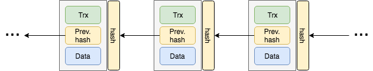
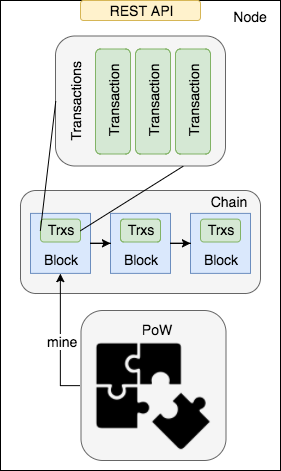

# ActorBlockChain

A a blockchain built using the Scala programming language and the actor model.

## The blockchain model

The tiniest blockchain model is like that:



The main components of our blockchain model are the Transaction, the Chain, the Proof of Work (PoW) algorithm, and the Node. The transactions are stored inside the blocks of the chain, that are mined using the PoW. The node is the server that runs the blockchain.



#### Transaction
Transactions register the movement of coins between two entities. Every transaction is composed by a sender, a recipient, and an amount of coin. Transactions will be registered inside the blocks of our blockchain.

#### Chain
The chain is a linked list of blocks containing a list of transactions. Every block of the chain has an index, the proof that validates it (more on this later), the list of transactions, the hash of the previous block, the list of previous blocks, and a timestamp. Every block is chained to the previous one by its hash, that is computed converting the block to a JSON string and then hashing it through a SHA-256 hashing function.

#### PoW
The PoW algorithm is required to mine the blocks composing the blockchain. The idea is to solve a cryptographic puzzle that is hard to solve, but easy to verify having the proof. The PoW algorithm that is implemented in Scalachain is similar to the Bitcoin one (based on Hashcash). It consists in finding a hash with N leading zeros, that is computed starting from the hash of the last block and a number, that is the proof of our algorithm.

We can formalize it as:
```
NzerosHash = SHA-256(previousNodeHash + proof)
```
The higher is N, the harder is to find the proof. In Scalachain N=4 (It will be configurable eventually).

#### Node
The Node is the server running our blockchain. It provides some REST API to interact with it and perform basic operations such as send a new transaction, get the list of pending transactions, mine a block, and get the current status of the blockchain.
